# Twenty images, forty million parameters

**Attention U-Net for retinal blood-vessel segmentation on DRIVE, in PyTorch.**
Patch-based training, hybrid Dice + focal loss, tile-and-stitch inference, and an honest look
at what the attention gates actually learned, which is not what the architecture diagram
promises.

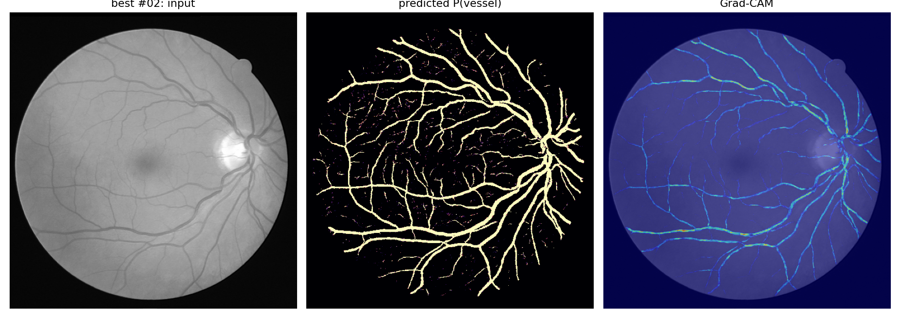

*The trained model on a test image: the fundus photograph going in, the vessel probability
coming out, and where the network was looking when it decided. All three panels come from the
seeded PyTorch retrain described below.*

This repo is one half of a pair. The other half is
[ALoG](https://github.com/sepehrkdi/retinal-vessel-segmentation-alog), which solves the same
task with three hand-set numbers and no training at all. Same dataset, same test split,
opposite philosophy. The [comparison](#the-trade) is at the bottom.

---

## The problem

The retina is the only place blood vessels can be photographed directly, and the shape of the
vessel tree changes in diabetic retinopathy, hypertension and glaucoma before the patient
notices anything. Measuring that change means tracing the tree first, and in DRIVE the tracing
was done by hand, by a trained observer, one vessel at a time.

<table>
<tr>
<td width="50%">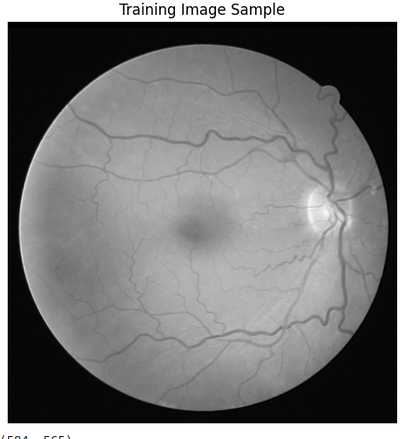</td>
<td width="50%">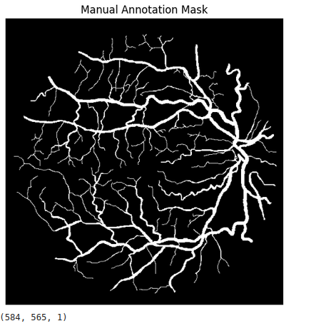</td>
</tr>
<tr>
<td align="center"><em>What the camera gives you (584x565).</em></td>
<td align="center"><em>What an expert's answer looks like. This is the target.</em></td>
</tr>
</table>

The sibling repo showed that you can get most of the way there by hand-designing a filter
shaped like a vessel, and that doing so tells you precisely where the method fails: on 1-2
pixel capillaries, because a fixed-scale filter is tuned to one width. So the question this
repo asks is the natural follow-up. **If the network learns its own filters instead of being
handed them, does it do better, and can you still see why?**

## What makes it hard: twenty images

A U-Net wants tens of thousands of training examples. DRIVE gives you 20.

The observation that rescues this is that **a vessel is a local object**. You do not need to
see the whole retina to decide whether a given pixel sits on a vessel; a 128x128 window around
it contains everything relevant. Which means one image is not one training example. It is
thousands of overlapping windows.

Sliding a 128x128 window at **stride 8** across the 20 training images yields **63,800
patches**. And critically, this is not the same as resizing. Downscaling an image to fit the
network would shrink the capillaries into the interpolation error, destroying the one signal
the task depends on. Patching preserves every vessel at its true scale.

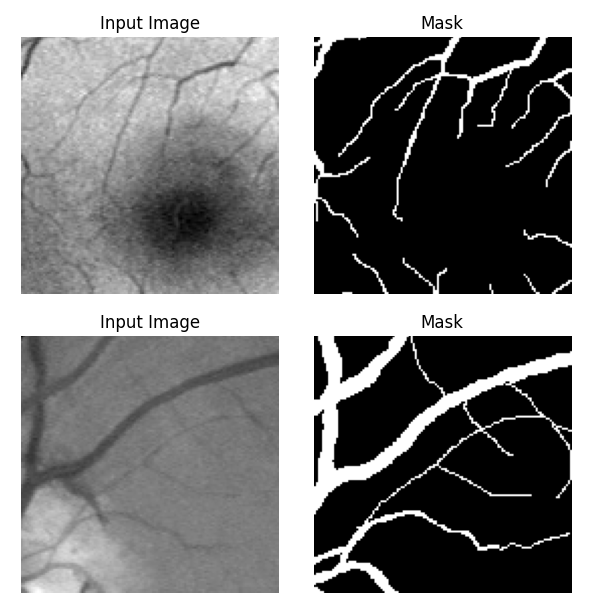

*Two sampled patches with their masks. Compare these to the full fundus image above: at this
scale the thin vessels are still several pixels wide and still clearly visible, which is
exactly the point. Resizing the whole image down to 128x128 would have erased them.*

## Designing the rest

**Class imbalance.** Roughly 12.7% of the pixels inside the retina are vessels. Plain
cross-entropy is perfectly happy to predict "background" everywhere and call it a good day. Two
losses are composed to prevent that: **Dice**, which scores overlap and is blind to the ocean
of correctly-predicted background, plus **binary focal loss** with `alpha=0.9, gamma=7`. Those
are aggressive settings, deliberately: a gamma of 7 drives the loss on easy pixels to nearly
nothing, so almost all the gradient comes from the handful of pixels the model is currently
getting wrong.

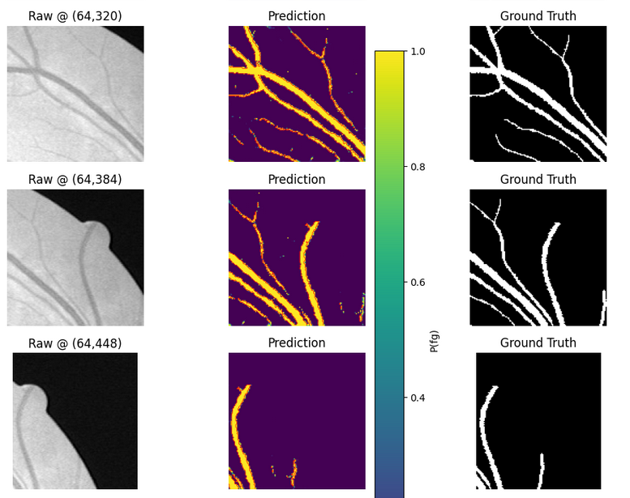

*Raw patch, predicted P(vessel) on the colour scale at the centre, ground truth. Note how
little of the prediction is mid-scale green or teal: the output is nearly all dark purple or
bright yellow. That confident, near-binary behaviour is the focal term doing its job.*

**Architecture.** A 4-level encoder (64/128/256/512) into a 1024 bottleneck, with attention
gates on the skip connections and **40.4 M parameters**. The intent behind the gates is that
each decoder level should learn to weight its own skip connection, letting vessel features
through and suppressing background. The output head is split into `vessel_logits` (Conv 1x1, no
activation) and then `vessel_prob` (sigmoid); numerically this is identical to a single sigmoid
conv, but it exposes a logit tensor for the Grad-CAM analysis further down.

**Getting back to a full image.** The model sees 128x128 patches, so inference reflect-pads the
image, tiles it at stride 64, averages the overlaps and thresholds at 0.5.

### Training

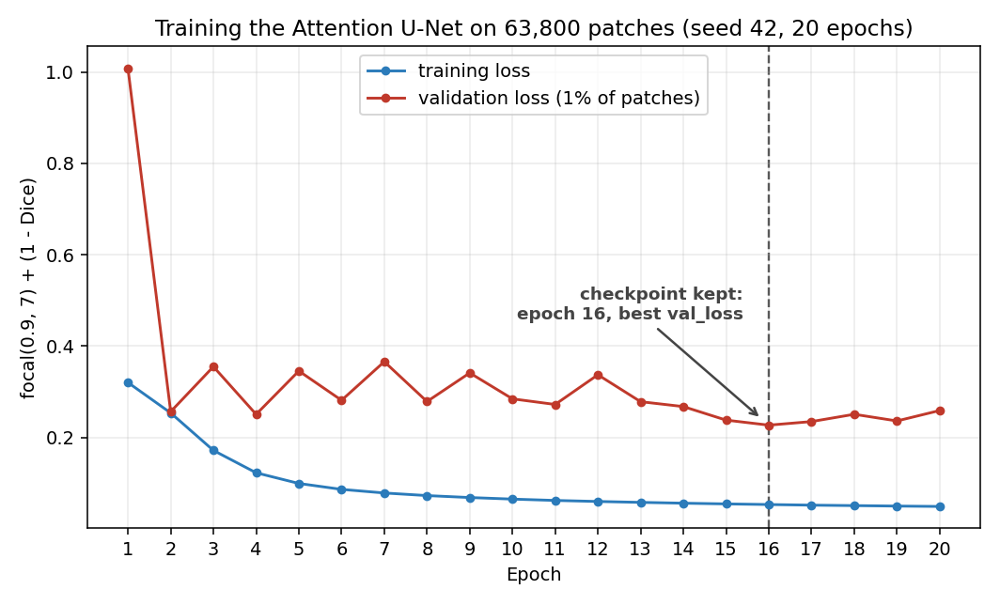

**How to read this.** Blue is the loss on the training patches, red is the loss on the held-out
1% validation split, and the dashed line marks the checkpoint that was kept. The blue curve
drops smoothly and keeps dropping. The red one is violently jagged, because 1% of the patches
is a very small sample and every epoch lands somewhere different. That noise is the reason
this repo monitors `val_loss` rather than `val_accuracy`, and it is the single clearest
argument in the repo for the "1% validation" entry in the limitations.

One practical note not visible on this plot: eval-mode metrics are meaningless until the
BatchNorm running statistics converge. At epoch 1 the model scores IoU 0.09; by epoch 2 it is
already at 0.63.

### Hyperparameters (faithful to the original run)

| Setting | Value | Note |
|---|---|---|
| Optimizer | Adam | Keras default learning rate **1e-3** |
| Batch size | 8 | |
| Epochs | 20 | |
| Early stopping | **none** | the notebook defined `EarlyStopping` but never passed it to `fit`; we match that |
| Validation split | **1%** | last 1% of patches (Keras-equivalent), fixed before shuffling |
| Loss | focal(0.9, 7) + (1 - Dice) | |
| Seed | 42 | the original run was unseeded |
| Checkpoint monitor | `val_loss` | notebook used `val_accuracy`; `val_loss` is the better signal on this imbalanced task |

These correct several inaccuracies in the original project write-up, which listed Adam 1e-4,
batch 4, patience-5 early stopping and a 95/5 split, none of which match the code that actually
produced the reported numbers.

## What actually happened

> The explainability work in this section belongs to the **2026 PyTorch re-implementation**.
> The original 2025 course project did no inspection of the model's internal representations;
> its auditing was strictly at the input and output level.

The attention gates were the interesting part of the architecture, so they were the first thing
inspected. They do not behave the way the tidy coarse-to-fine story predicts.

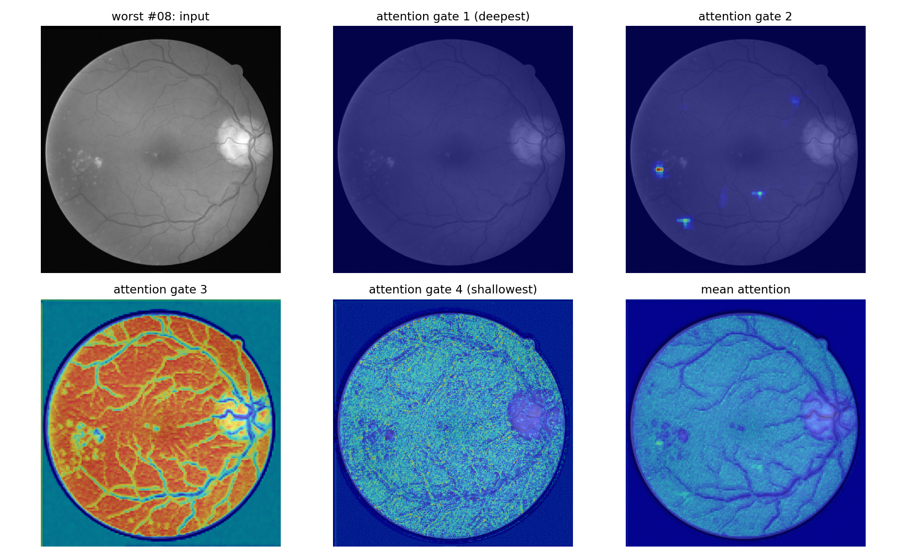

**How to read this.** Top left is the input; the other five panels are the four attention gates
and their mean, rendered as heatmaps over the retina. Yellow and red are high gate activation,
dark blue is low.

Gates 1 and 2, the deepest, are almost flat: a uniform blue wash, selecting nothing. Gate 4,
the shallowest, is a fine-grained speckle that looks like noise. **Gate 3 carries essentially
all of the structure, and look at its colours: the vessel tree is drawn in blue and cyan
against an orange-red background.** It is *low* on the vessels and *high* everywhere else, the
exact inverse of "attend to the vessels".

The same pattern holds on the easiest image, so it is not an artefact of one hard case:

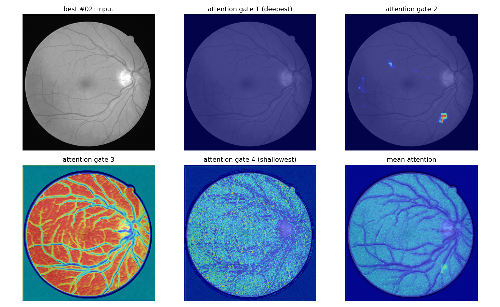

That is worth stating plainly rather than quietly cropping out of the figure. The gates are
doing something useful, since the model works, but "attention gates highlight the vessels" is
not a description of this trained model, and a README that claimed it would be wrong.

The model itself is not confused, though, which you can see by asking a different question.
Grad-CAM on the vessel logits lands where you would hope:

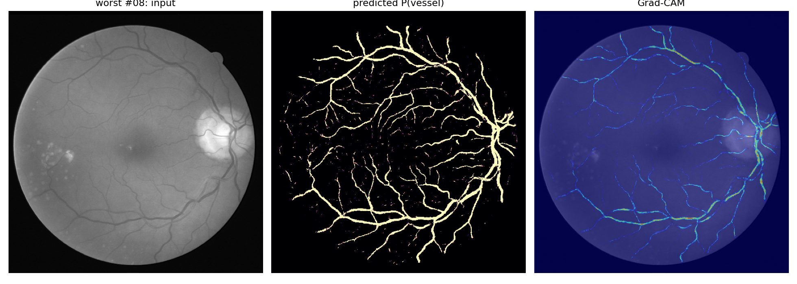

**How to read this.** Input, predicted P(vessel), then the Grad-CAM heatmap: bright green and
yellow mark the pixels whose features most drove the vessel decision. The bright tracery
follows the vessel tree almost exactly. **"The model looks at the vessel tree" holds. "The
gates look at the vessel tree" does not.** Both statements are in this repo because both are
true, and only one of them is the story you would expect from the architecture's name.

### Results

DRIVE test split (20 images), patch 128 / stride 64 / threshold 0.5, over all pixels with no
field-of-view masking, mean +/- std across the 20 images:

| | Accuracy | IoU | F1 (Dice) |
|---|---|---|---|
| **This PyTorch retrain** (seed 42, epoch 16) | **0.9617** +/- 0.0032 | **0.6337** +/- 0.0286 | **0.7754** +/- 0.0215 |
| Original TF/Keras run (unseeded, checkpoint lost) | 0.9639 | 0.6383 | 0.7787 |

> **Reproducibility note.** The original model was trained in TensorFlow/Keras on Colab. That
> run was **unseeded** and its checkpoint was **lost**. This repo re-implements the same
> architecture and hyperparameters in PyTorch and retrains from scratch. All three metrics land
> within 0.5 pp of the originally reported numbers across both a framework port and a seeded
> re-run, but the retrained figures are the committed truth. The original TF notebook is kept
> verbatim as [CV_Project.ipynb](CV_Project.ipynb) for provenance.

Here is what a prediction looks like against the ground truth, pixel by pixel:

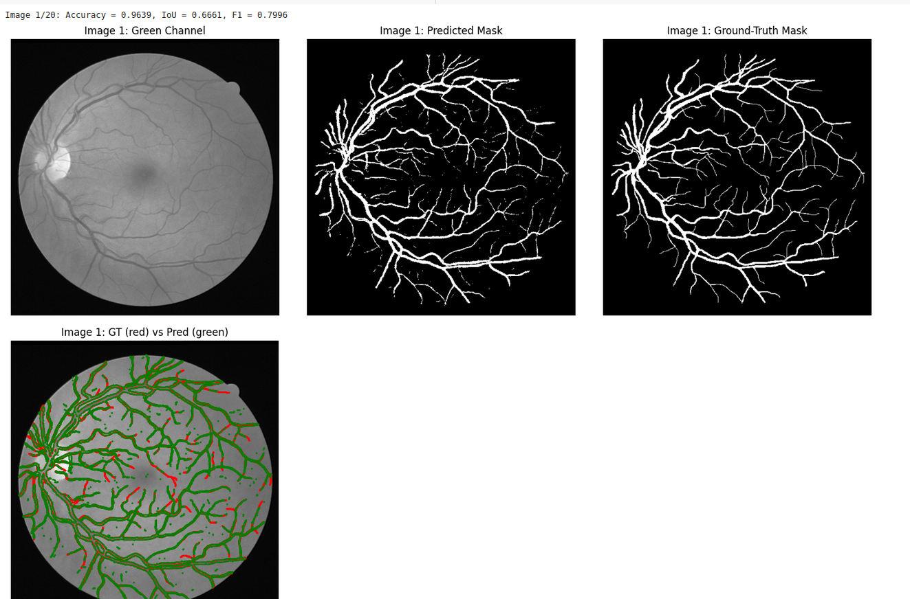

**How to read this.** Green channel, predicted mask, ground-truth mask, and at the bottom the
two overlaid: **green is agreement, red is ground-truth vessel the model missed.** The red is
concentrated in short stubs at the ends of fine branches and along vessel edges, not in whole
missing trunks. That is the failure mode the width analysis below quantifies.

> This particular rendering is from the **original TF run**, which is why its header reads
> 0.9639 / 0.6661 / 0.7996; the seeded retrain scores 0.9605 / 0.6534 / 0.7904 on this same
> image. It is kept because the overlay is the clearest picture of *where* the errors sit, and
> the error pattern is unchanged.

The `BaselineUNet` (plain U-Net, no attention) is **provided but not trained**. There is no
measured baseline row here, so no attention-versus-no-attention ablation is claimed.

## Where it breaks

The same width-stratified audit as the sibling repo: skeletonize each ground-truth mask, assign
a width to every vessel pixel, pool recall and precision by width bin.

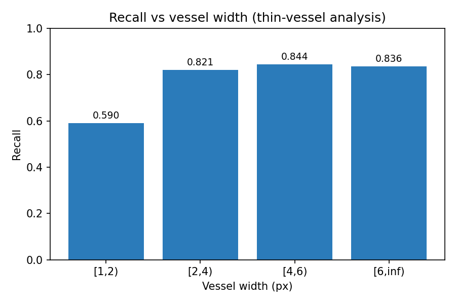

**How to read this.** Every ground-truth vessel pixel is binned by how wide its vessel is, and
each bar is the fraction of that bin the model found. A width-agnostic segmenter would give
flat bars. The leftmost bar, the 1-2 pixel capillaries, is the one that falls away.

| Width (px) | GT pixels | Recall | Precision | F1 |
|---|---|---|---|---|
| [1,2) | 172,710 | 0.590 | 0.580 | 0.585 |
| [2,4) | 186,897 | 0.821 | 0.848 | 0.834 |
| [4,6) | 148,072 | 0.844 | 0.923 | 0.881 |
| [6,inf) | 70,266 | 0.836 | 0.965 | 0.896 |

Recall climbs steeply from **0.590** on the thinnest vessels to 0.844, then plateaus, dipping
marginally on the widest bin. Precision and F1 rise monotonically with width.

The residual error on **wide** vessels turned out not to be what it looks like. Wide retinal
vessels have a bright central reflex, a specular stripe down the middle, which is a classic
cause of segmenters splitting a vessel in two. That is not what is happening here: 55.8% of the
false negatives fall in the outer third of the vessel against 12.6% of the true positives, and
mean centre-ness is 0.480 versus 0.733. The misses are at the **boundaries**, not the
centrelines, which matches the thin red edging visible in the overlay above. This is ordinary
boundary under-segmentation, and the tempting central-reflex story is wrong.

## The trade

Same dataset, same 20-image test split. One method learns its filters, the other is handed
them:

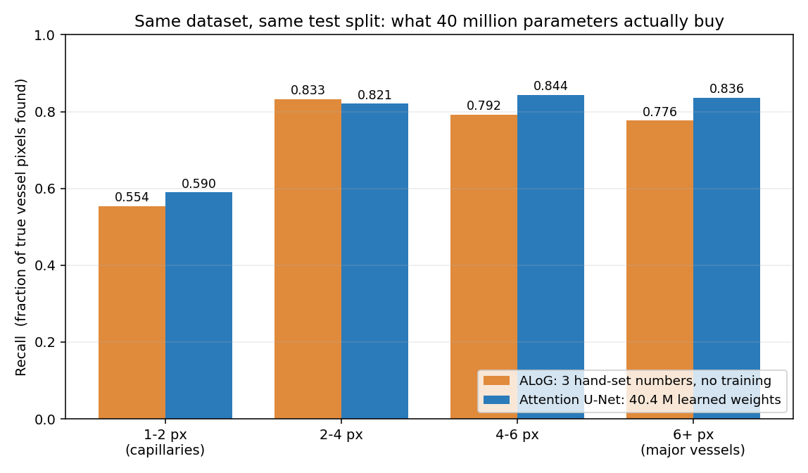

**How to read this.** Blue is this repo, 40.4 M parameters trained for hours on a GPU. Orange
is the sibling repo: three hand-set numbers and no training whatsoever. If learned features
were decisively better, the blue bars would tower over the orange. They do not. On 2-4 px
vessels the hand-built filter is marginally **ahead**, and on the capillaries that are
clinically hardest and diagnostically earliest, the entire advantage is 0.554 against 0.590.

| | [ALoG](https://github.com/sepehrkdi/retinal-vessel-segmentation-alog) (hand-built) | Attention U-Net (this repo) |
|---|---|---|
| Free parameters | 3 grid-searched scalars | 40.4 M learned weights |
| Training | none | ~2-5 h on an RTX 3060 |
| F1 (Dice) | 0.712 +/- 0.029 | 0.775 +/- 0.021 |
| IoU | 0.554 +/- 0.035 | 0.634 +/- 0.029 |
| Recall, 1-2 px vessels | 0.554 | 0.590 |
| Recall, 2-4 px vessels | 0.833 | 0.821 |

Forty million parameters and a GPU buy about **6 points of F1** over three numbers you can
write on a napkin. The learned model wins, and the size of the win is worth knowing.

> **Protocol note.** ALoG metrics are FOV-restricted; this repo's are whole-image with no FOV
> masking. F1 and IoU have no true-negative term, so they stay broadly comparable. **Accuracy
> does not** and is deliberately absent from this table. The thin-vessel bars are exactly
> comparable: both are pooled over identical ground-truth pixel counts.

## Dataset

**DRIVE** (Digital Retinal Images for Vessel Extraction): 20 training and 20 test fundus images
at 584x565, with first-observer manual annotations. Images are read as grayscale; masks are read
from the original `.gif` in memory, because the original notebook's destructive in-place
GIF-to-TIF conversion is **not** used here. Set the dataset root in
[src/rbvs/data.py](src/rbvs/data.py) (`DRIVE_ROOT`).

## Repository structure

```
src/rbvs/            # library
  seed.py            # single-seed reproducibility
  data.py            # DRIVE loading + 128px patch extraction (63,800 patches)
  model.py           # AttentionUNet + BaselineUNet, split logit/prob head
  losses.py          # binary focal (alpha=0.9, gamma=7) + Dice
  metrics.py         # accuracy / IoU / F1
  infer.py           # reflect-pad tile-and-stitch full-image prediction
  explain.py         # attention-gate maps + Grad-CAM
  analysis.py        # thin-vessel width stratification
scripts/
  train.py           # local-GPU retrain (primary path)
  evaluate.py        # test-set metrics -> CSV
  explain.py         # attention / Grad-CAM figures
  analyze.py         # thin-vessel table + plot
  figures.py         # training curves + the cross-repo comparison chart
  fetch_weights.py   # download weights from the GitHub Release
notebooks/
  demo.ipynb         # minimal inference demo
  colab_train.ipynb  # no-local-GPU training path (Colab)
Figures/             # every figure in this README, plus per-image CSVs
results.md           # regenerated by evaluate.py (the README above is self-contained)
requirements.txt  LICENSE  .gitignore
CV_Project.ipynb     # original TF/Keras notebook (historical record, untouched)
```

Per-image numbers live in `Figures/metrics_per_image.csv` and are regenerated by
`scripts/evaluate.py` rather than hand-edited. `Figures/figure_overall_average_metrics.png` and
`figure_gt_vs_pred_overlay.png` are console output and overlays from the **original TF run**,
kept for provenance; the retrained numbers above supersede them.

## How to run

### Local GPU (primary path)

```bash
python3.11 -m venv .venv && . .venv/bin/activate
pip install --extra-index-url https://download.pytorch.org/whl/cu128 -r requirements.txt
# set DRIVE_ROOT in src/rbvs/data.py, then:
env PYTHONHASHSEED=42 python -u scripts/train.py         # ~2-5 h on an RTX 3060
python scripts/evaluate.py                                # -> results.md + metrics CSV
python scripts/analyze.py                                 # -> thin-vessel table + plot
python scripts/explain.py --images best,median,worst      # -> attention/Grad-CAM PNGs
python scripts/figures.py                                 # -> training curves, comparison chart
```

### No local GPU

Use [notebooks/colab_train.ipynb](notebooks/colab_train.ipynb) (Colab T4), which mirrors
`scripts/train.py`.

### Weights

Trained weights are **not committed**; they are published as a GitHub Release asset. Once the
release exists:

```bash
python scripts/fetch_weights.py     # -> checkpoints/attention_unet.weights.pt
```

## Limitations

- **Threshold sensitivity.** All metrics depend on the 0.5 binarization threshold.
- **1% validation.** A very small, fixed validation set, matching the original run. The jagged
  red curve in the training plot is what that costs.
- **No FOV masking.** Metrics are whole-image, unlike the sibling repo. See the protocol note.
- **No measured baseline.** `BaselineUNet` exists but was not trained, so the value of the
  attention gates is not quantified here.
- **Single annotator.** Only the first-observer masks are used.
- **Retrain drift.** The original was unseeded and its checkpoint lost, so these numbers are a
  faithful re-run rather than a bit-exact reproduction.

## Dependencies

PyTorch (CUDA 12.8 build), NumPy, OpenCV (headless), scikit-image, SciPy, Matplotlib, Pillow,
tqdm. See [requirements.txt](requirements.txt).

## License and citation

MIT, see [LICENSE](LICENSE).

```bibtex
@techreport{khodadadi2025rbvs,
  title  = {Retinal Blood-Vessel Segmentation with Attention U-Net and Patch Sampling},
  author = {Khodadadi, Sepehr},
  institution = {University of Genoa},
  year   = {2025},
  type   = {Computer Vision Course Project}
}
```
