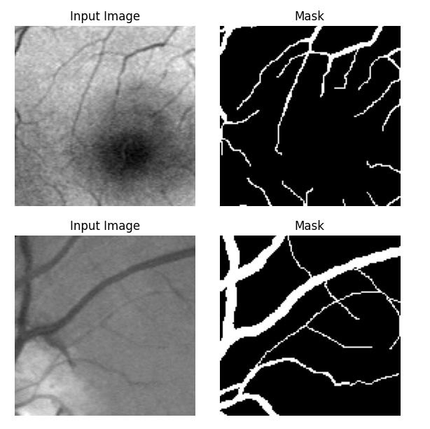

# Retinal Blood Vessel Segmentation Project

## Overview

This repository contains the complete implementation and documentation of a **Retinal Blood Vessel Segmentation** project using **Attention U-Net** with patch-based training. This work was developed as part of a Computer Vision course at the University of Genoa in the second semester of 2025.

## Project Description

The project addresses the critical challenge of automatically segmenting retinal blood vessels from fundus images to aid in early detection of diabetic retinopathy and other vascular diseases. The solution implements an enhanced U-Net architecture with attention mechanisms and introduces a patch-based training strategy to overcome dataset limitations.


*Example of retinal fundus image from the DRIVE dataset and corresponding vessel segmentation*

### Key Contributions

1. **Attention U-Net Implementation**: Enhanced baseline U-Net with attention gates to suppress irrelevant background features
2. **Dense Patch Sampling**: Novel training strategy using overlapping 128×128 patches to augment limited training data
3. **Hybrid Loss Function**: Combined Dice loss with Binary Focal loss to address class imbalance
4. **Comprehensive Evaluation**: Thorough analysis on the DRIVE benchmark dataset

## Technical Achievements

### Performance Metrics
- **Accuracy**: 96.39%
- **IoU (Intersection over Union)**: 63.83%
- **F1-Score**: 77.87%


*Overall performance metrics achieved on the DRIVE test dataset*

### Key Technical Innovations
- Patch-based training with 63,800 overlapping patches from 20 training images
- Attention mechanisms that improve thin vessel detection
- Tile-and-stitch inference strategy to reconstruct full-size predictions
- Advanced loss function combining region-overlap and hard-example mining

## Repository Structure

```
├── notebooks/
│   ├── CV_Project.ipynb              # Main implementation notebook
│   └── Copy_of_RBVS_UNet.ipynb      # Alternative implementation with executed cells
├── docs/
│   ├── main.tex                      # LaTeX source for scientific report
│   ├── refs.bib                      # Bibliography
│   └── scientific_report.pdf         # Final compiled scientific report
├── figures/
│   ├── figure_overall_average_metrics.png    # Performance metrics visualization
│   ├── figure_dataset_example.png           # DRIVE dataset examples
│   ├── figure_patch_examples.png            # Training patch samples
│   ├── figure_patches_raw_pred_gt.png       # Prediction vs ground truth
│   ├── figure_gt_vs_pred_overlay.png        # Overlay comparisons
│   ├── figure_image_1_metrics_and_masks.png # Detailed analysis
│   └── annot_example.png                    # Example annotations
├── README.md                         # Project documentation
├── requirements.txt                  # Python dependencies
└── .gitignore                       # Git ignore rules
```

## Implementation Details

### Dataset
- **DRIVE Dataset**: Digital Retinal Images for Vessel Extraction
- 20 training images + 20 test images
- Resolution: 565×584 pixels
- Challenge: Limited training data for deep learning

### Methodology

#### 1. Data Preprocessing
- Conversion of GIF mask files to TIF format
- Grayscale image loading (abandoned green channel due to false positives)
- Pixel intensity normalization to [0,1] range
- Binary mask thresholding

#### 2. Patch Extraction Strategy
- **Patch Size**: 128×128 pixels
- **Training Stride**: 8 pixels (heavy overlap for data augmentation)
- **Inference Stride**: 64 pixels (reduced redundancy)
- **Total Patches**: ~63,800 from 20 training images


*Examples of extracted patches used for training, showing input images and corresponding ground truth masks*

#### 3. Network Architecture
- **Base**: U-Net encoder-decoder with 4 downsampling levels
- **Enhancement**: Attention gates in skip connections
- **Parameters**: ~40 million
- **Key Features**:
  - Double convolution blocks with ReLU activation
  - 2×2 max pooling and transposed convolutions
  - Attention-gated skip connections
  - Sigmoid output for probability maps

#### 4. Attention Mechanism
The attention gates filter encoder features before skip connections:
- Linear projections of encoder and decoder features
- Additive attention with learned spatial masks
- Feature gating to suppress irrelevant regions
- Only 2% parameter increase over baseline U-Net

#### 5. Loss Function
**Combined Loss = Dice Loss + Binary Focal Loss**
- **Dice Loss**: Optimizes region overlap, handles class imbalance
- **Binary Focal Loss**: Emphasizes hard-to-classify pixels (α=0.9, γ=7)
- **Result**: Better detection of thin, low-contrast vessels

#### 6. Training Protocol
- **Optimizer**: Adam (learning rate: 1×10⁻⁴)
- **Epochs**: 20 with early stopping (patience: 5)
- **Batch Size**: 4
- **Validation Split**: 95/5 train/validation
- **Hardware**: Google Colab Tesla T4 GPU
- **Training Time**: ~10 minutes per epoch

#### 7. Inference Strategy
- Tile-and-stitch approach with overlap averaging
- Reflection padding to handle boundaries
- Probability accumulation and normalization
- Binary thresholding (τ = 0.5)


*Visualization of patch-level predictions: raw patches, model predictions, and ground truth masks*

## Results and Analysis

### Quantitative Results
The model achieved competitive performance on the DRIVE benchmark:

| Model | Accuracy | IoU | F1-Score |
|-------|----------|-----|----------|
| Baseline U-Net | 95.50% | 62.00% | 76.40% |
| **Our Attention U-Net** | **96.39%** | **63.83%** | **77.87%** |
| BDDU-Net (SOTA) | 95.58% | 67.41% | 80.53% |

### Key Improvements
- **+2% IoU improvement** over baseline U-Net
- Better preservation of thin vessel structures
- Maintained high overall accuracy
- Reduced false positive rate compared to traditional preprocessing


*Detailed analysis of segmentation results: input image, predicted mask, ground truth, and overlay comparison*

### Limitations Identified
1. **Threshold Sensitivity**: Performance varies with binarization threshold
2. **Computational Cost**: Dense patch sampling increases memory usage
3. **Inference Time**: Overlap-averaging adds computational overhead


*Overlay comparison showing ground truth (red) vs predictions (green) highlighting model performance*

## Generated Visualizations

The project includes comprehensive visualizations that demonstrate the effectiveness of the approach:

### 📊 Performance Analysis
- **Metrics Summary**: Overall accuracy, IoU, and F1-score across test dataset
- **Qualitative Results**: Visual comparison of predictions vs ground truth
- **Error Analysis**: Identification of challenging cases and failure modes

### 🔬 Technical Illustrations  
- **Dataset Examples**: Representative samples from DRIVE benchmark
- **Patch Sampling**: Visualization of training data augmentation strategy
- **Attention Mechanism**: How attention gates improve feature selection
- **Inference Pipeline**: Step-by-step prediction process visualization

## Usage and Reproducibility

### Google Colab Access
The complete implementation is available in Google Colab:
[**Interactive Notebook with Trained Weights**](https://colab.research.google.com/drive/1DBvdWY8Vw_HIo0jMHd9fOHY-Cog2nbwD?usp=sharing)

### Key Dependencies
- TensorFlow 2.x / Keras
- OpenCV (cv2)
- NumPy
- Matplotlib
- PIL (Pillow)
- Google Colab utilities

### Running the Code
1. Open the provided Google Colab notebook
2. Mount Google Drive for dataset access
3. Download DRIVE dataset via Kaggle API
4. Execute cells sequentially for training/inference
5. Pre-trained weights included for immediate testing

## Future Work

### Proposed Improvements
1. **Multi-scale Ensemble**: Combine predictions at multiple resolutions
2. **Topology-preserving Loss**: Maintain vessel connectivity
3. **Threshold Optimization**: Adaptive thresholding strategies
4. **Efficiency Improvements**: Reduce computational overhead
5. **Cross-dataset Validation**: Test generalization on other retinal datasets

### Research Directions
- Integration with clinical workflows
- Real-time processing optimization
- Uncertainty quantification
- Federated learning for multi-institutional data

## Impact and Applications

### Medical Significance
- **Early Diabetic Retinopathy Detection**: Automated screening capabilities
- **Clinical Decision Support**: Quantitative vessel analysis
- **Population Health**: Large-scale screening programs
- **Telemedicine**: Remote diagnostic capabilities

### Technical Contributions
- Demonstrated effectiveness of attention mechanisms in medical imaging
- Validated patch-based training for limited dataset scenarios
- Established baseline for retinal vessel segmentation research

## Acknowledgments

This work was developed under the guidance of the Computer Vision course instructors at the University of Genoa. The project leverages the DRIVE dataset and builds upon established U-Net architecture principles while introducing novel enhancements for medical image segmentation.

## License and Citations

If you use this work in your research, please cite:

```bibtex
@techreport{khodadadi2025rbvs,
  title={Retinal Blood-Vessel Segmentation with Attention U-Net and Patch Sampling},
  author={Khodadadi Hosseinabadi, Sepehr},
  institution={University of Genoa},
  year={2025},
  type={Computer Vision Course Project}
}
```

---

**Contact**: Sepehr Khodadadi Hosseinabadi (Student ID: 6660699)  
**University**: University of Genoa  
**Date**: June 2025
